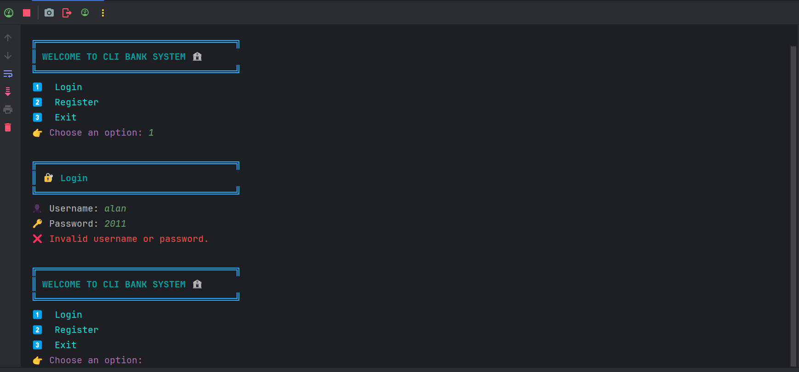
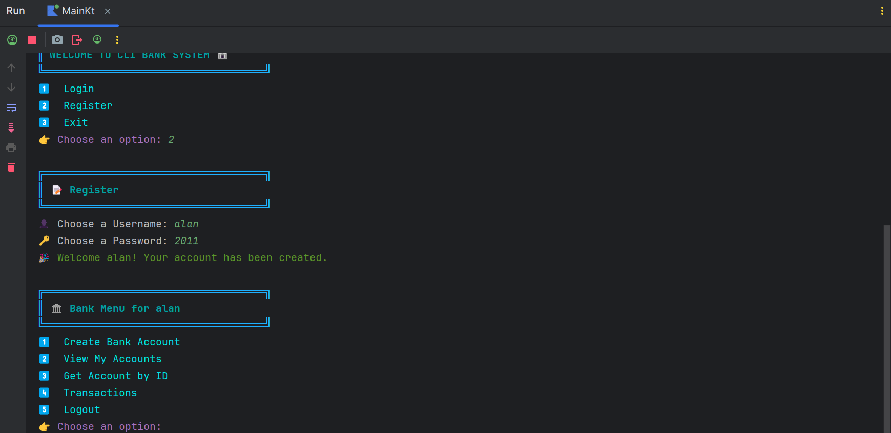
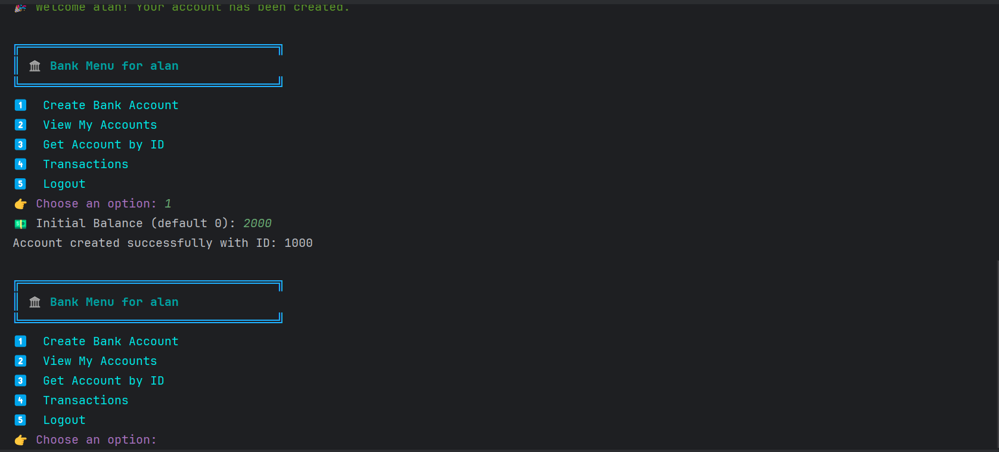
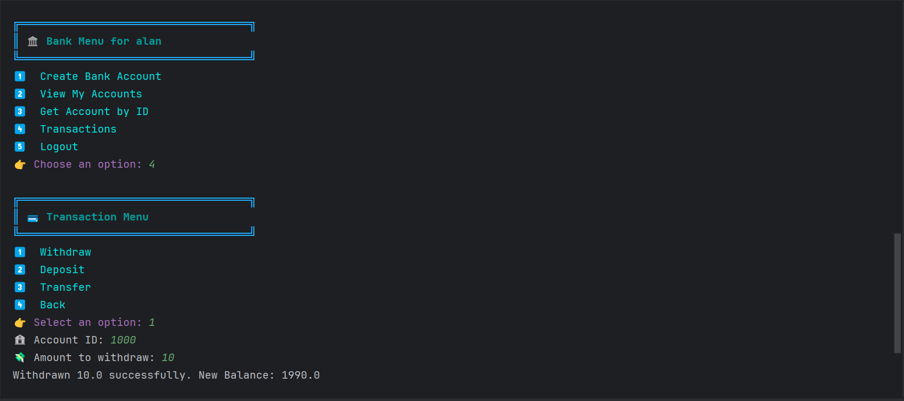

# 🏦 Kotlin CLI Banking System (Practice Project)

This project is built **entirely for practice purposes**, aiming to review and reinforce core programming concepts in Kotlin. It simulates a simple **banking system via the command line (CLI)** and is structured using clean design principles.

---
### Login and Register Menu

### Bank Menu

### Create Bank Account

### Transaction Menu

---
## 🎯 Project Purpose

- ✅ **Practice Kotlin Basics**:  
  Variables, conditionals, loops (`for`, `while`, `do-while`), functions, lambda expressions, collections, error handling, etc.

- ✅ **Review Object-Oriented Programming (OOP) Principles**:  
  - Classes and Objects  
  - Inheritance  
  - Polymorphism (Overriding & Overloading)  
  - Encapsulation (Access Modifiers)  
  - Abstraction (Abstract Classes and Methods)  
  - Special Kotlin classes: `data`, `enum`, `sealed`, `anonymous`  
  - `companion object`

- ✅ **Apply Clean Architecture & Separation of Concerns (SoC)**:  
  Code is modularized into `model`, `dao`, `service`, and `view` layers to ensure maintainability and scalability.

- ✅ **Use Basic Design Patterns**:  
  - DAO (Data Access Object) pattern  
  - Singleton for services  
  - In-memory storage for data simulation

- ✅ **Prepare for Coroutine Integration**:  
  Although not the focus here, the project structure is ready to support Kotlin Coroutines for asynchronous operations.

---

## 📁 Project Structure

```

├── data/
│   ├── dao/           → Interfaces & in-memory implementations
│   └── model/         → Data classes (User, BankAccount, Transaction)
├── service/           → Business logic for users, accounts, and transactions
├── utils/             → Coroutine utils (optional)
├── view/              → Console-based UI for interaction
└── Main.kt            → Entry point

````

---

## 🚀 How to Run

```bash
git clone  https://github.com/alanhasn/Kotlin-CLI-Banking-System-with-OOP-Coroutines-DAO-SoC-Practice

// now you can run Main.kt file
````

---

## ✅ Notes

* This is **not a production-grade system**, but rather a personal practice project.
* Ideal for anyone preparing for a Kotlin exam or reviewing concepts before building real apps.

---

**Feel free to fork, modify, and expand it!**
